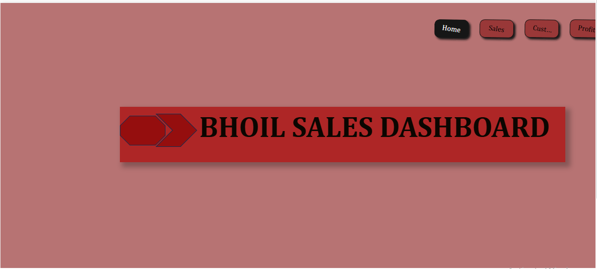
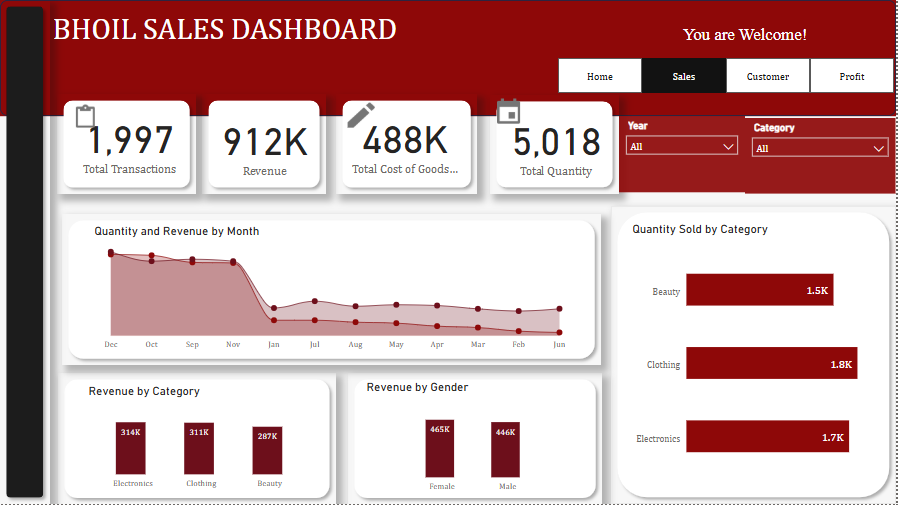
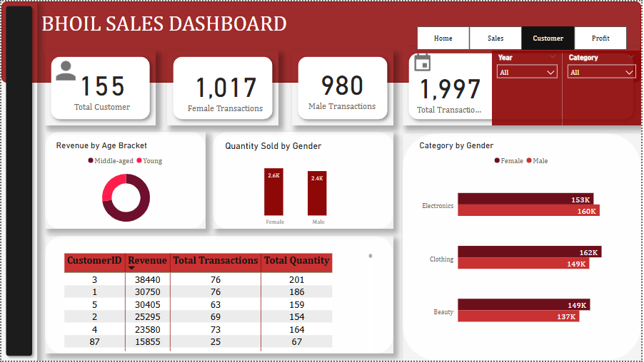
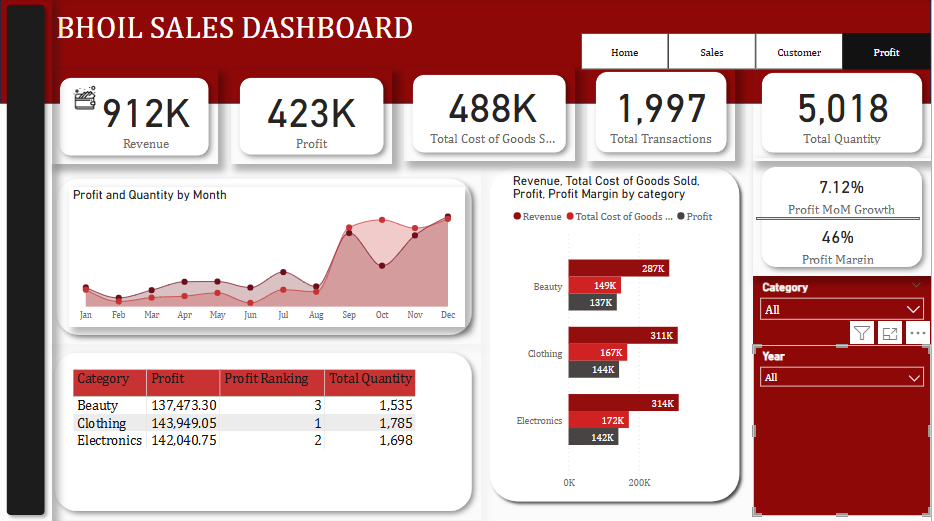
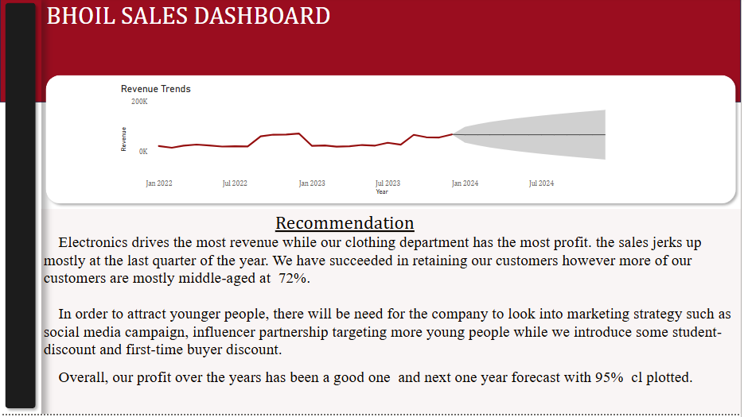

# Bhoil-Sales-Dashboard-with-Power-BI

## Introduction 

Have you ever wondered what drives customer loyalty in retail — price, convenience, or something deeper?

I analyze growth drivers and identify customers buying patterns by building an interactive retail sales dashboard using PowerBI, Power query and Power point.

## Skills
DAX
Tooltip
Visuaization
Bookmarks
PowerQuery

## Objectives

Which product categories drive the most revenue?

How is sales performance trending over time?

How do gender and category impact sales?

Are we retaining customers or just attracting new ones?

How do customer preferences vary by gender or category?

Are customers buying more or less over time?

Which categories are most/least profitable?

Is profit growing consistently?

Where can we reduce cost or improve pricing?

## Key insights

🎯Revenue peaks in Q4, with 72% of customers in their middle age group.

🎯The company maintains a 46% profit margin, showing healthy financial performance.

🎯The top 10% of customers contribute over 40% of total revenue, highlighting the importance of retention strategies.

🎯Clothing emerged as the most profitable category.

🎯Impressively, over 95% of customers are repeat buyers, reflecting strong brand loyalty.

## Recommendation 

To sustain and grow this loyalty, especially among younger demographics, the company could introduce initiatives such as:

✍️Student discounts

✍️First-time buyer offers

These insights can help the company:

📍Optimize inventory ahead of peak seasons

📍Invest in loyalty programs

📍Target high-value customers more effectively

